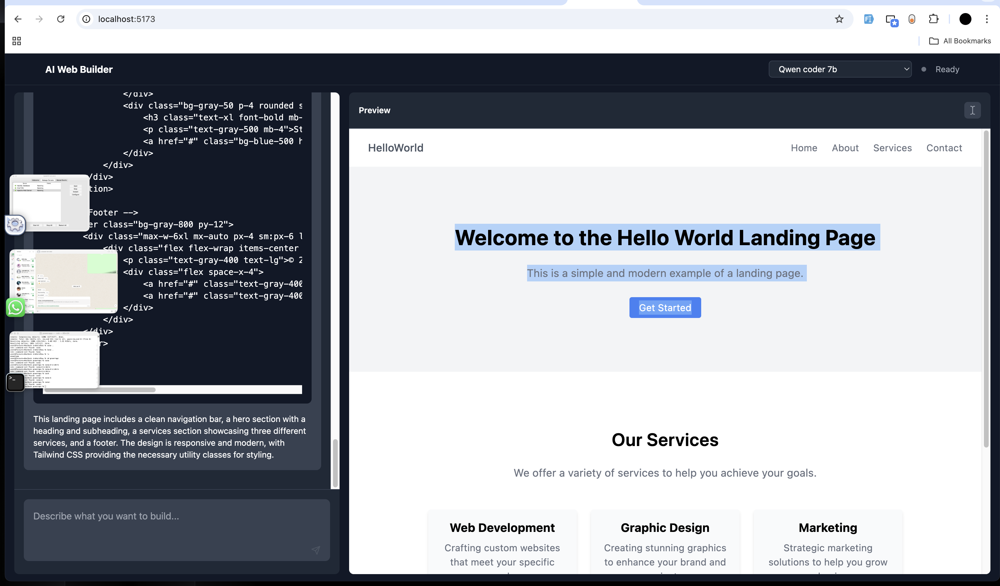

# React + TypeScript + Vite Project

This is a modern web application built with React, TypeScript, and Vite. It uses Ai connected with LM studio to generate web page based on user input 



## Tech Stack

- React
- TypeScript
- Vite
- Tailwind CSS
- ESLint

## Getting Started

### Prerequisites

- Node.js (version 14 or higher)
- npm or yarn

### Installation

1. Clone the repository
2. Install dependencies:
```bash
npm install
# or
yarn
```

### Development

To start the development server:
```bash
npm run dev
# or
yarn dev
```

### Building for Production

To create a production build:
```bash
npm run build
# or
yarn build
```

## Project Structure

```
src/
  ├── App.tsx        # Main application component
  ├── main.tsx       # Application entry point
  ├── index.css      # Global styles
  └── vite-env.d.ts  # TypeScript declarations
```